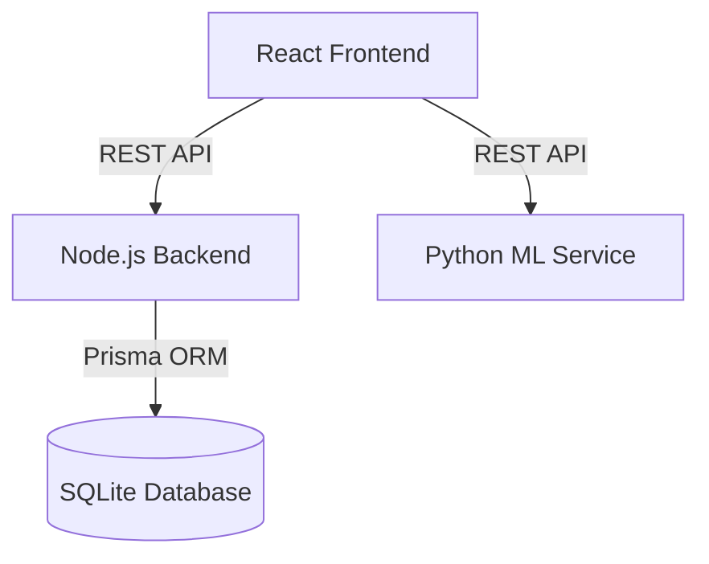
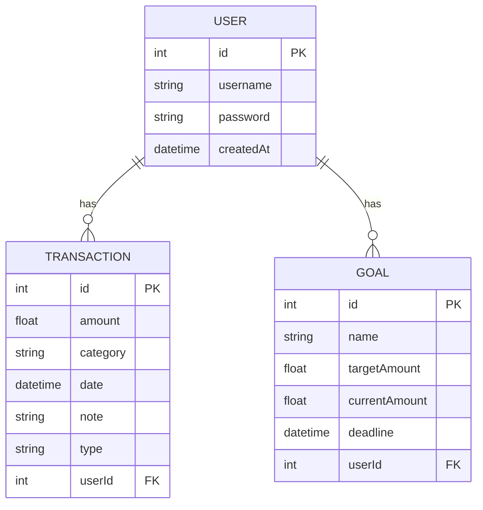

# FinVision Enterprise Platform

An enterprise-grade, AI-powered financial analytics and credit intelligence platform featuring a vintage luxury banking theme. Built as a demonstration of full-stack engineering, microservices architecture, and machine learning integration.

## Business Problem
Modern financial tools often lack the aesthetic elegance of classic banking and the intelligent insights needed for deep personal or enterprise financial planning. FinVision bridges this gap by offering a stunning, glassmorphism-inspired UI with robust analytical tools powered by machine learning and Generative AI.

## Solution Architecture
FinVision adopts a modern microservices architecture to ensure scalability, clean separation of concerns, and ease of deployment:
- **Frontend (Vite + React + TS):** High-performance SPA with Tailwind CSS, Framer Motion, and Recharts.
- **Backend API (Node.js + Express):** RESTful service handling authentication, CRUD operations, and data aggregation using Prisma ORM.
- **ML Service (Python + FastAPI):** Dedicated microservice for compute-intensive tasks, including Credit Risk prediction and AI insights.

## Features
- **Vintage Luxury UI:** Dark brown, gold, bronze, and cream palette.
- **Secure Authentication:** JWT-based user access control.
- **Advanced Dashboard:** Real-time financial health, income/expense tracking, and interactive charts.
- **Machine Learning Integration:** Credit risk scoring using ensemble-like logic (Random Forest / XGBoost readiness) and anomaly detection.
- **Financial AI Assistant:** Context-aware chatbot for tailored financial advice.

## Technology Stack
- **Frontend:** React, TypeScript, Vite, Tailwind CSS v4, Recharts, Framer Motion, Lucide React
- **Backend:** Node.js, Express, Prisma ORM, SQLite (Easily swappable to PostgreSQL)
- **ML Service:** Python, FastAPI, Scikit-learn, XGBoost, Pandas
- **Authentication:** JWT, bcrypt

## System Architecture Diagram


## Database Schema


## Installation & Configuration Guide

### 1. Backend Setup
```bash
cd backend
npm install
npx prisma migrate dev
npx tsx index.ts
```
*Note: Make sure to create a `.env` file with `JWT_SECRET="finvision_vintage_super_secret"` and `DATABASE_URL="file:./dev.db"`.*

### 2. ML Service Setup
```bash
cd ml_service
python -m venv venv
# Activate venv: .\venv\Scripts\Activate.ps1
pip install fastapi uvicorn scikit-learn pandas numpy xgboost
uvicorn main:app --reload --host 0.0.0.0 --port 8000
```

### 3. Frontend Setup
```bash
cd frontend
npm install
npm run dev
```

## Security Measures
- **Password Hashing:** `bcrypt` implementation.
- **Stateless Auth:** JSON Web Tokens (JWT) for secure session management.
- **Input Validation:** Required fields enforced on both client and server sides.

## Future Enhancements
- Integration with live bank feeds (Plaid API).
- Advanced K-Means clustering for customer segmentation.
- Production deployment via Docker and Kubernetes.

## Interview Talking Points
- **Why SQLite instead of Postgres for the demo?** To ensure zero-configuration setup for immediate demonstration, though Prisma makes it trivial to swap to Postgres by merely changing the provider string and connection URL.
- **Microservices approach:** Decoupling the ML logic into a Python FastAPI service prevents Node.js thread blocking during heavy computations.
- **UI/UX Strategy:** Leveraging Tailwind v4 with a custom `@theme` allows for a highly cohesive design system mimicking premium banking brands.
